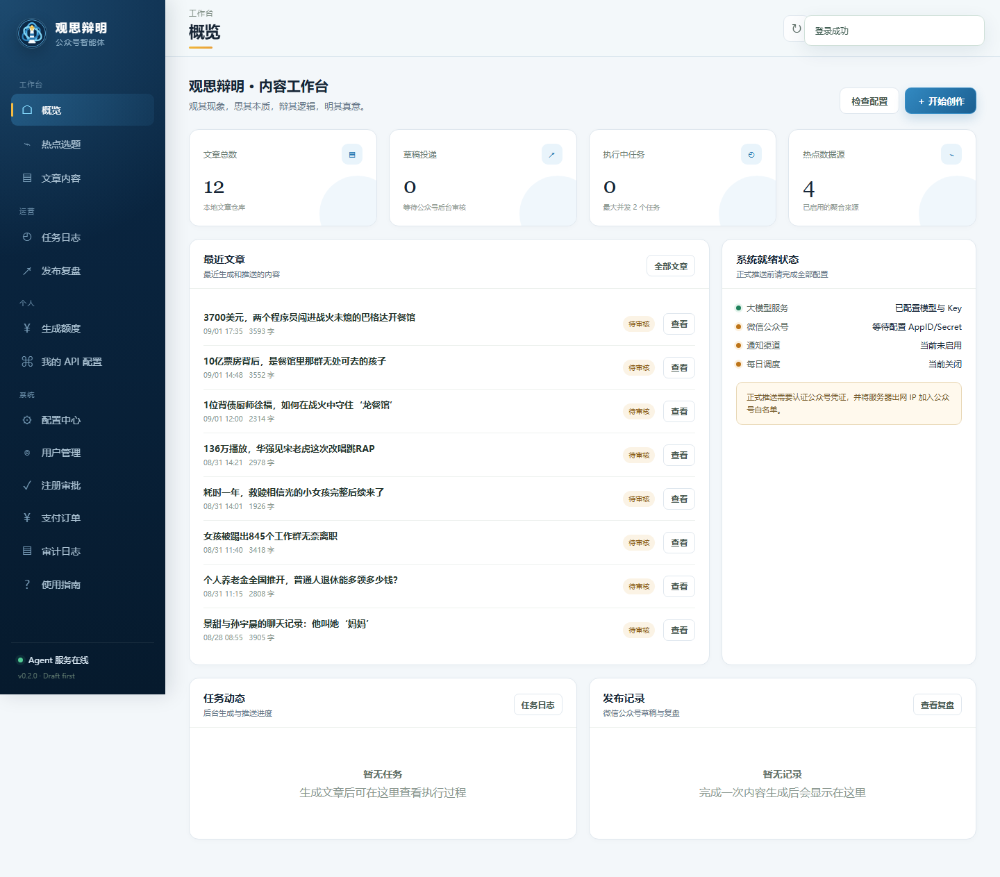
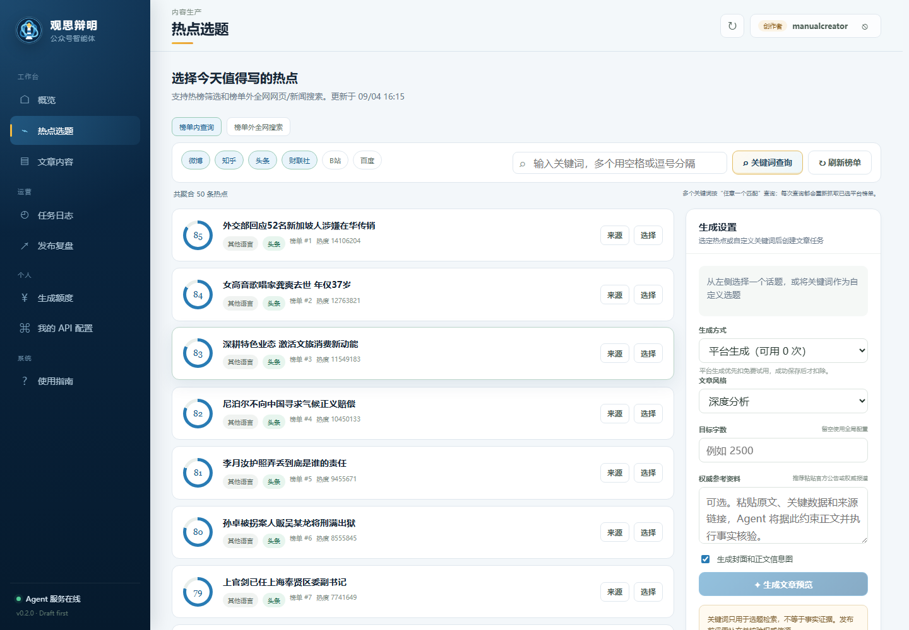

# 观思辩明 · 公众号自动发文 Agent 智能体

公众号 **观思辩明** 的自研 Python Agent：每天自动完成 **热点采集 → 选题评分 → AI 写作 → 配图/封面 → 微信排版 → 投递公众号草稿箱 → 通知人工发表**。

> 默认是合规的半自动模式：系统只投递草稿箱，管理员终审后在公众号后台点击“发表”。不使用模拟登录。

## 线上体验

**[打开网页，体验热点选题与文章生成](http://39.96.80.70/)** · [查看用户使用手册](web/manual/USER_MANUAL.md)

网页端可浏览热点、选择话题、生成并编辑文章。注册申请需按页面提示完成公众号私信核对，由管理员人工审批；实际可用功能与额度以线上配置为准。

## 界面预览

> 以下为界面示意，实际页面以线上版本为准。

**内容工作台** · 集中查看热点、文章与任务



**热点选题** · 从榜单筛选话题，也可搜索榜单外内容



**文章内容** · 生成后继续查看和编辑，而非直接发表


## 关注公众号

扫码关注 **观思辩明**。申请体验时，按注册页面提示在公众号私信中发送注册手机号，供管理员人工核对。


更多操作步骤见 [用户使用手册](web/manual/USER_MANUAL.md)。

## 当前状态

MVP 已实现：

- [x] 微博、知乎、今日头条、财联社、B站、百度热点抓取
- [x] 热点标题/摘要/标签多关键词查询及自定义选题回退
- [x] Tavily 榜单外网页/新闻搜索、时效筛选与原文证据采集
- [x] 搜索结果按内容中文占比优先排序，支持“中文优先”开关与语言标注
- [x] 黑名单/白名单、热度、排名、跨平台去重与综合评分
- [x] SQLite/MySQL 双后端：7 天选题去重、用户/额度/支付/审计与运行记录
- [x] OpenAI 兼容 LLM 抽象：本地 vLLM/Ollama/LM Studio 和外部 DeepSeek 可切换
- [x] 多阶段写作：大纲 → 分节 → 合并 → 去 AI 味润色 → 标题优化
- [x] 图片服务仅需选择 Pillow 或自定义源；自定义 URL 自动识别 OpenAI Images、百炼与 Token Plan 协议
- [x] Markdown → 微信内联样式 HTML
- [x] 微信官方 API：stable_token、正文图片、永久封面素材、draft/add 草稿
- [x] 飞书/企业微信 webhook 通知人工发表
- [x] APScheduler 守护调度 + Linux cron/systemd 模板
- [x] FastAPI + 零构建 SPA Web 管理台（无需 Node/npm）
- [x] Web 配置中心：密钥脱敏、连接测试、调度与账号定位
- [x] 热点选择、异步生成进度、Markdown 编辑和公众号样式预览
- [x] 信源网页采集、人工参考资料、证据约束写作与生成后事实核验
- [x] 标题/Markdown 异常输出清洗、文章本地删除与旧封面标题迁移
- [x] 一键复制公众号富文本正文（含内联样式与图片）、标题及封面 PNG
- [x] 正文配图按核心章节语义生成与分散插入，避免堆积在引言
- [x] 正文配图使用无文字主题插画，单图失败时跳过而不伪装成文字卡片
- [x] 任务日志协作式暂停、继续、取消与已结束日志删除
- [x] 图片服务源自动匹配 Key、提交端点和轮询主机，并拦截 Coding Plan/文本端点误配
- [x] 人工合规确认后推草稿、任务日志、版本历史与发布复盘
- [x] 管理员 Token、同源 CSP、路径防穿越和昂贵操作限流
- [x] dry-run、本地归档、CLI、自动化测试

## 技术架构

以下为系统组件与数据流概览。图片服务源可在 Web 配置中心设置。

```text
浏览器 Web 管理台（配置 / 选题 / 编辑 / 预览 / 推草稿）
  ↕ FastAPI + 后台任务队列
定时器
  → 多源热点采集
  → 7天历史去重 + 选题评分
  → 本地/外部 LLM 多阶段写作
  → 封面和内文配图
  → Markdown 转微信 HTML
  → 微信官方 API 投递草稿箱
  → 飞书/企微通知人工终审发表
```

## 目录

```text
config/
  config.yaml          # 非密钥配置
  .env.example         # 密钥模板
src/wechat_agent/
  config.py            # YAML + .env 配置
  hot_topics.py        # 热点抓取
  topic_selector.py    # 评分、过滤、去重
  database.py          # SQLite/MySQL 通用连接与 SQL 兼容层
  history.py           # SQLite/MySQL 历史与复盘
  llm.py               # OpenAI 兼容 LLM 客户端
  writer.py            # 多阶段写作 Agent
  images.py            # 封面/配图
  formatter.py         # 微信 HTML 排版
  wechat_api.py        # 官方公众号 API
  pipeline.py          # 全链路编排
  notify.py            # 飞书/企微通知
  scheduler.py         # 定时任务
  web_core.py          # 安全配置、任务队列、热点服务
  article_store.py     # Web 文章、版本与草稿推送
  web_app.py           # FastAPI API 与静态资源服务
  web_models.py        # Web 请求校验模型
  main.py              # CLI
web/                    # 零构建 SPA：HTML/CSS/ES Modules
output/                 # 每次运行产物、Web 文章和 history.db
deploy/                 # Linux systemd/cron/Nginx 模板
tests/                  # 单元测试
```

## 1. Linux 安装

```bash
git clone <your-repo> /opt/wechat-agent
cd /opt/wechat-agent

python3 -m venv .venv
source .venv/bin/activate
pip install -U pip
pip install -e .

cp config/.env.example config/.env
chmod 600 config/.env
```

要求 Python 3.12+（f-string 内联正则等 PEP 701 语法；3.10/3.11 会在导入时报 SyntaxError）。

## 2. 配置密钥

编辑 `config/.env`：

```dotenv
WECHAT_APP_ID=你的公众号AppID
WECHAT_APP_SECRET=你的公众号AppSecret
DEEPSEEK_API_KEY=你的DeepSeekKey
TAVILY_API_KEY=你的TavilyKey
NOTIFY_WEBHOOK_URL=飞书或企业微信机器人Webhook
JWT_SECRET=至少32位随机JWT签名密钥
PHONE_HASH_SECRET=至少32位且与JWT不同的手机号HMAC密钥
USER_CONFIG_SECRET=至少32位的用户个人API配置加密密钥
INITIAL_ADMIN_PASSWORD=首次启动管理员密码
# WEB_ADMIN_TOKEN=可选的旧自动化兼容Token
```

编辑 `config/config.yaml`：

- 确认 `wechat.publish_mode: draft_only`
- 设置账号定位、读者画像、热点白名单与黑名单
- 设置通知类型 `feishu` 或 `wecom`
- 公众号后台把云服务器**出网 IP 加入 IP 白名单**（常见错误码 `40164`）

### 本地模型

只要本地服务提供 OpenAI 兼容的 `/v1/chat/completions`：

```yaml
llm:
  base_url: "http://127.0.0.1:8000/v1"
  api_key: "sk-local"
  model: "qwen2.5-14b-instruct"
```

### 外部 DeepSeek

```yaml
llm:
  base_url: "https://api.deepseek.com/v1"
  api_key: "${DEEPSEEK_API_KEY}"
  model: "deepseek-chat"
```

可以让本地模型负责初稿、外部模型负责润色；下一阶段可把 `writer.py` 扩展为多后端路由器。

## 3. Web 管理台

启动本地管理台：

```bash
wechat-agent web --host 127.0.0.1 --port 8000
```

浏览器打开 `http://127.0.0.1:8000`。管理台包括：

- **概览**：系统配置、任务、文章和草稿状态
- **配置中心**：模型、公众号、图片、通知、调度、账号定位；密钥只允许更新，不回传明文
- **热点选题**：多源搜寻、评分、筛选、选择话题
- **文章内容**：后台生成进度、候选标题、Markdown 编辑、封面与公众号 HTML 预览
- **草稿推送**：人工审核和 AI 内容声明双重确认后才允许调用 `draft/add`
- **任务日志 / 发布复盘**：任务进度、错误信息、草稿 ID 和阅读互动数据
- **注册审批**：用公众号私信手机号精确匹配申请，人工确认后默认批准为创作者并赠送试用额度
- **试用与计费**：免费次数、按次价格可配置；成功生成才扣除，失败自动退回；管理员可人工充值
- **用户管理 / 审计日志**：账号、角色、额度、状态及完整关键操作审计；支持删除账号（文章自动转移给执行管理员，最后一个管理员受保护）；编辑弹窗可为存量账号补录手机号明文
- **文章隔离与共享**：admin 查看全部；editor/creator 默认管理自己的文章；viewer 仅查看获授权文章

管理台使用原生 ES Modules，不依赖 Node/npm，也没有额外的前端构建步骤。

### 生产部署

生产部署可使用 `deploy/` 中的 systemd/cron/Nginx 模板，按实际环境配置 HTTPS、安全加固、备份与回滚。

```bash
sudo cp deploy/wechat-agent-web.service /etc/systemd/system/
sudo systemctl daemon-reload
sudo systemctl enable --now wechat-agent-web
```

再参考 `deploy/nginx-wechat-agent.conf` 配置域名、HTTPS 和反向代理。生产环境必须设置独立的 `JWT_SECRET`、`PHONE_HASH_SECRET` 与 `USER_CONFIG_SECRET`（均至少 32 位）。未登录请求不会因 `WEB_ADMIN_TOKEN` 为空而自动放行；该变量只保留给明确携带 `X-Admin-Token` 的旧自动化调用。

## 3. 用户认证与人工注册审批

首次启动且数据库中没有有效管理员时，系统创建用户名 `admin`：

- 配置了 `INITIAL_ADMIN_PASSWORD`：使用该密码；创建完成后应从环境变量删除并立即修改。
- 未配置：启动日志输出一次性随机密码，不再使用固定默认密码。

### 登录流程

1. 访问 `http://your-domain`，进入登录页。
2. 输入用户名密码，Access Token 2 小时过期，Refresh Token 7 天过期并自动续期。
3. 管理员可在“用户管理”页面创建账号、分配角色、重置密码或禁用账号。
4. 用户被禁用或角色调整后，已有 Token 会在下一个 API 请求立即失效或应用新角色。

### 无微信 API 的公开注册流程

1. 管理员在“配置中心 → 公开注册与人工审批”中开启注册，并配置公众号名称、二维码和提示语。
2. 用户注册用户名、密码和中国大陆手机号，账号状态为“待审核”。
3. 用户关注“观思辩明”公众号，并在私信中发送注册时填写的完整手机号。
4. 管理员在公众号后台看到私信后，进入“注册审批”，粘贴手机号精确查询。
5. 管理员勾选“已在公众号私信中核对该手机号”，默认批准为 `creator` 创作者。
6. 首次审批通过后，系统按配置赠送免费试用次数（默认 3 次）；同一手机号 HMAC 只赠送一次。
7. 系统不调用微信接口，因此不能自动检测关注、私信或取消关注；人工核对是批准依据。

手机号保存明文（`users.phone` 列），管理员在用户管理和注册审批页面可直接查看完整号码；同时保留由 `PHONE_HASH_SECRET` 生成的 HMAC 用于唯一性约束和精确匹配。普通日志和审计日志仍只记录末四位掩码。

### 环境变量

| 变量 | 必填 | 说明 |
|---|---|---|
| `JWT_SECRET` | 生产必填 | JWT 私钥，至少 32 位随机串 |
| `PHONE_HASH_SECRET` | 开启注册时必填 | 手机号精确查询 HMAC 密钥，至少 32 位且不能与 JWT 相同 |
| `USER_CONFIG_SECRET` | 是 | 加密保存用户个人 LLM、Tavily 和文生图配置；至少 32 位，丢失后无法解密 |
| `INITIAL_ADMIN_PASSWORD` | 首次部署可选 | 初始管理员密码；留空时生成一次性随机密码 |
| `WEB_ADMIN_TOKEN` | 否 | 旧自动化兼容 Token；空值绝不会匿名放行 |

### 用户级 API 配置

- LLM、Tavily 和文生图配置由每个用户在“我的 API 配置”中独立维护，并使用 `USER_CONFIG_SECRET` 加密写入当前数据库后端（生产 MySQL，本地默认 `output/auth.db`）。
- editor/creator 可选择“个人 API”（不扣平台额度）或“平台生成”（优先扣试用次数，再扣付费额度）。
- 管理员可在配置中心 → 用户与计费，通过“对用户开放「我的 API 配置」”开关控制该功能：关闭后普通用户的个人 API 页面与生成方式中的“使用我的 API”选项被隐藏，接口返回 `PERSONAL_API_DISABLED`；管理员自身不受影响。
- 平台生成调用系统统一配置的大模型和搜索服务；管理员没有个人配置时也可回退系统默认配置。
- 微信公众号、通知、调度和注册审批仍是系统级配置。
- 管理员只能看到其他用户的“已配置/未配置”状态并可清除，不能查看或导出密钥明文。

### 免费试用、人工充值与微信支付

- `billing.default_trial_count` 默认 3 次，`billing.price_per_generation_fen` 默认 200 分（2 元）。
- 生成任务提交时原子预占额度；文章成功保存后扣除，模型、搜索、核验失败或取消时释放。
- 服务重启会释放超过 120 分钟的过期预占；额度变化和管理员人工充值均写入独立流水及审计日志。
- 平台套餐默认不包含外部文生图，使用本地 Pillow；管理员可在配置中心开放并控制最大文章字数。
- 人工充值继续保留：管理员在用户管理中根据线下收款结果增加付费次数。
- 可选微信支付 API v3 Native：用户扫码支付后，签名回调或主动查单确认 `SUCCESS` 才会自动到账；订单号、金额、AppID、商户号和交易号全部执行服务端校验。
- 微信支付回调使用微信支付公钥/平台证书验签，并使用 API v3 Key 执行 AES-GCM 解密；重复通知通过事件 ID 和交易号幂等处理。
- 未配置商户凭证、公钥、32 字节 API v3 Key 或 HTTPS 通知地址时，在线购买安全关闭，不影响试用、个人 API 和人工充值。

### 文章归属与共享

- 新生成文章记录 `owner_user_id`；升级前旧文章首次启动时统一归属首个有效 admin。
- admin 可访问全部文章；editor 默认管理并可推送自己的文章；creator 可生成、编辑、删除自己的文章但不能推送；viewer 默认无文章。
- 管理员可按文章向 editor/creator/viewer 授予 `view`，向 editor/creator 授予 `edit`，仅向 editor 授予 `push`；共享权限不包含删除。
- 文章正文、版本、附件、签名图片 URL 和生成任务均在后端执行归属检查，不能依赖前端隐藏按钮绕过。

### 研究型写作与质量门禁

- 生成阶段不再只依赖热点标题：系统自动执行多源新闻研究（Tavily 多查询 + 来源页抓取 + 用户参考链接逐条抓取），为每条证据编号（S1、S2…）并区分官方原文、权威媒体报道和普通网页。
- 制度/政策类选题强制检索政府与司法机关原文；找不到官方原文时，正文不得对制度内容、适用范围和效果下结论。
- 证据等级（strong/medium/weak）决定文章结构和篇幅：weak（实质信源不足两条）直接拒绝生成，不再产出空泛长文。
- 写作方法遵循“事实前置—来源归因—机制解释—判断边界”；正文禁止反复罗列“待核实”，也不允许先声明未核实再替传闻下结论。
- 事实核验逐项输出断言清单（claim→source 映射）、信息量评分和静态质量指标；核验失败、空修订、占位文本都会让任务失败，而不是保存半成品。
- 推送公众号草稿前，服务端强制校验核验状态：`failed`、`stale`、未核验或 `high` 风险一律拒绝，与前端确认无关。
- 人工编辑保存后核验自动标记 `stale`，必须重新核验后才能推送。

### 权限矩阵

| 功能 | admin | editor | creator | viewer |
|---|---|---|---|---|
| 查看文章/热点/任务 | ✅ | ✅ | ✅ | ✅ |
| 生成文章 | ✅ | ✅ | ✅ | ❌ |
| 编辑/保存自己的文章 | ✅ | ✅ | ✅ | ❌ |
| 删除自己的文章 | ✅ | ❌ | ✅ | ❌ |
| 推送草稿 | ✅ | ✅ | ❌ | ❌ |
| 控制自己的任务 | ✅ | ✅ | ✅ | ❌ |
| 修改系统配置 | ✅ | ❌ | ❌ | ❌ |
| 管理用户/额度 | ✅ | ❌ | ❌ | ❌ |
| 查看审计日志 | ✅ | ❌ | ❌ | ❌ |

## 4. 首次运行

先检查配置：

```bash
wechat-agent check-config
```

先执行 dry-run（会调用热点源和 LLM，但不调用微信 API）：

```bash
wechat-agent run --dry-run --articles 1 --sources zhihu,toutiao
```

输出位置：

```text
output/YYYYMMDD_HHMMSS/
  selected_topics.json
  article_1/article.md
  article_1/article.html
  article_1/cover.png
  article_1/inline_1.png
  result.json
```

确认本地内容没问题后，去掉 `--dry-run`：

```bash
wechat-agent run --articles 1
```

系统会：上传封面和正文图 → 建草稿 → 通知管理员。随后登录公众号后台审阅并发表。

## 5. 定时运行

### 方案 A：Linux cron（简单可靠）

```bash
chmod +x /opt/wechat-agent/deploy/run_daily.sh
crontab -e
```

每天 08:30：

```cron
30 8 * * * /opt/wechat-agent/deploy/run_daily.sh
```

### 方案 B：APScheduler + systemd

在 `config/config.yaml` 开启：

```yaml
schedule:
  enabled: true
  daily_time: "08:30"
  timezone: "Asia/Shanghai"
```

安装服务：

```bash
sudo cp deploy/wechat-agent.service /etc/systemd/system/
sudo systemctl daemon-reload
sudo systemctl enable --now wechat-agent
sudo systemctl status wechat-agent
```

## 6. 常用命令

```bash
# 检查配置
wechat-agent check-config

# 本地生成，不发布
wechat-agent run --dry-run --articles 1

# 投递草稿箱
wechat-agent run --articles 1

# 指定热点源
wechat-agent run --sources weibo,zhihu,toutiao,cls

# 查看历史/草稿状态
wechat-agent history --limit 20

# 启动 Web 管理台
wechat-agent web --host 127.0.0.1 --port 8000

# 内建定时守护
wechat-agent schedule
```

未安装为包时也可：

```bash
PYTHONPATH=src python -m wechat_agent.main check-config
```

## 7. 测试

```bash
pip install -e ".[dev]"
pytest -q tests
```

测试覆盖配置、选题过滤/去重、HTML 排版、草稿参数、Web 管理员 Token、密钥脱敏、静态页面、文章版本和异步任务。实现时已验证：

- Python 源码全部通过 `compileall`
- 所有前端 ES Modules 通过 `node --check`
- 13 个自动化测试通过
- Playwright 真实浏览器加载无 JavaScript 错误
- 桌面仪表盘、配置中心、文章编辑/公众号预览和移动端布局通过截图视觉验收
- Pillow 封面为 900×383，中文清晰、无乱码/截断

## 8. 公众号 API 路径

```text
POST /cgi-bin/stable_token
POST /cgi-bin/material/add_material?type=image    # 封面 media_id
POST /cgi-bin/media/uploadimg                     # 正文图片 URL
POST /cgi-bin/draft/add                           # 草稿 media_id
```

默认不调用 `freepublish/submit`。如改成 `freepublish`，需自行承担可见性异常及平台治理风险。

## 9. 合规与安全

- 认证订阅号优先使用官方 API；接口权限以公众号后台为准。
- 2025 年起微信从严治理“非真人自动化创作”；AI 内容应主动声明。
- 保留人工选题/审稿/发表节点，加入个人观点、真实案例和可靠来源。
- 不批量铺号，不生产同质化“AI 水文”。
- AppSecret、模型 Key、Webhook 不得提交到 Git。
- 不使用 Playwright/DrissionPage 模拟登录作为生产发布通道。

## 10. 已知限制与下一阶段

- 各平台免费热榜接口可能因反爬策略变化，需要持续维护适配器。
- 当前写作 Agent 使用热点标题和接口摘要，下一阶段应增加“权威信源检索/RAG + 引用核验”，减少幻觉。
- 当前文生图 API 适配为最小实现，生产中应增加异步任务轮询、重试和自动裁剪。
- 微信阅读数据回填接口已预留数据库字段，尚未自动对接统计 API。
- 建议下一阶段增加：权威信源检索与事实核验 Agent、多人 RBAC、富文本编辑器、自动读取公众号统计 API 和发布后数据飞轮。

