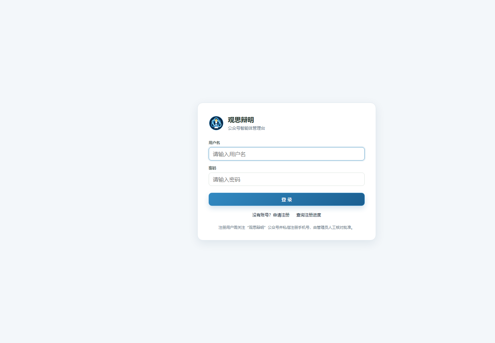
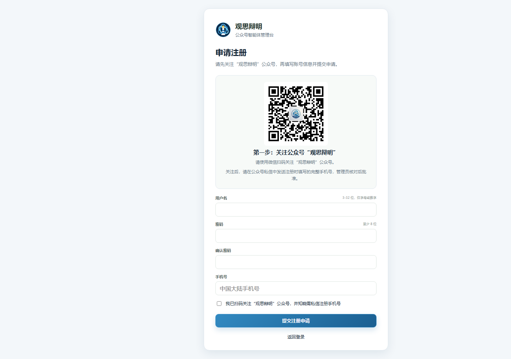
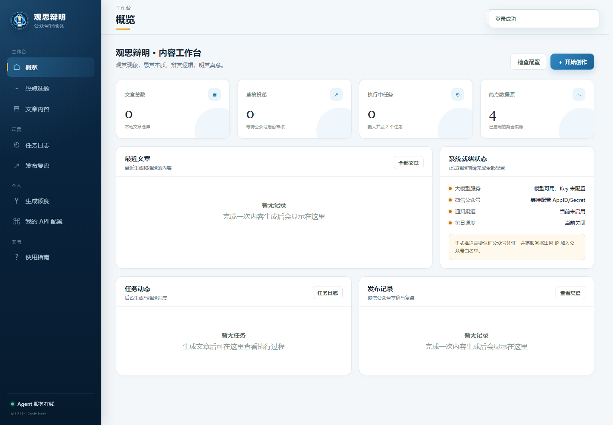
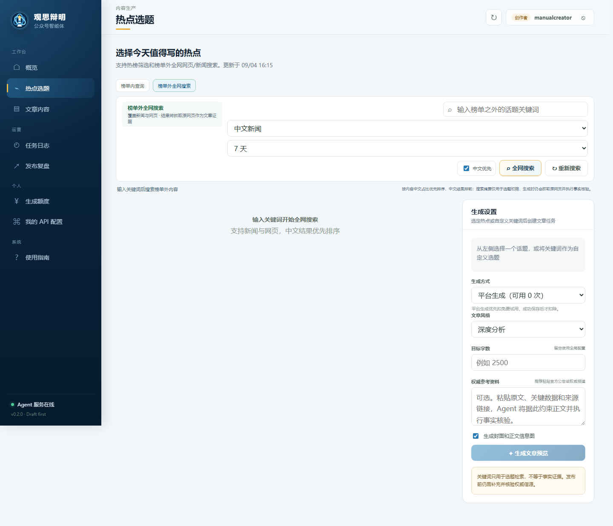
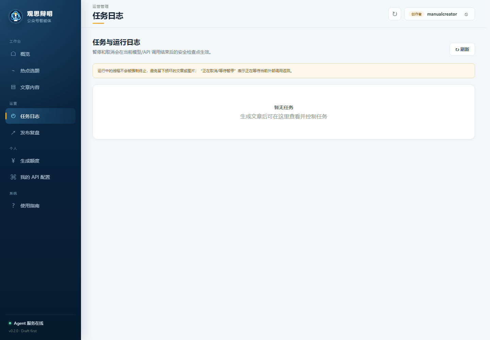
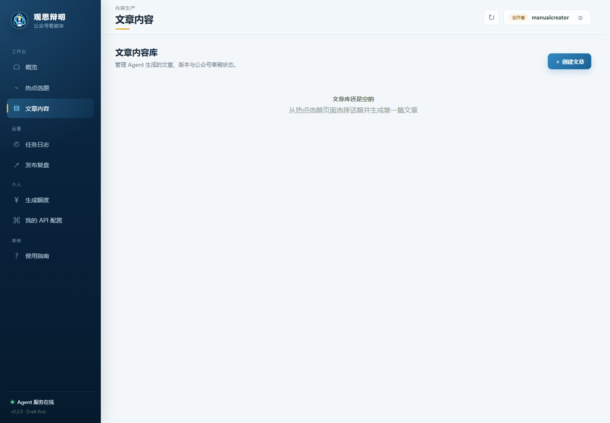
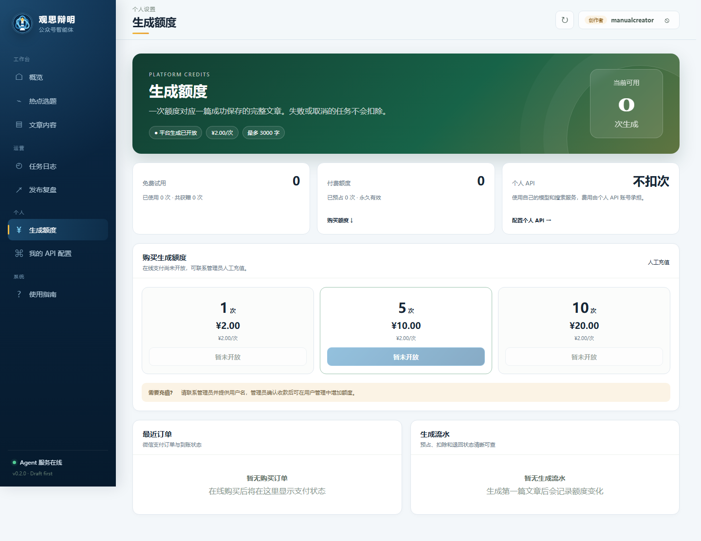
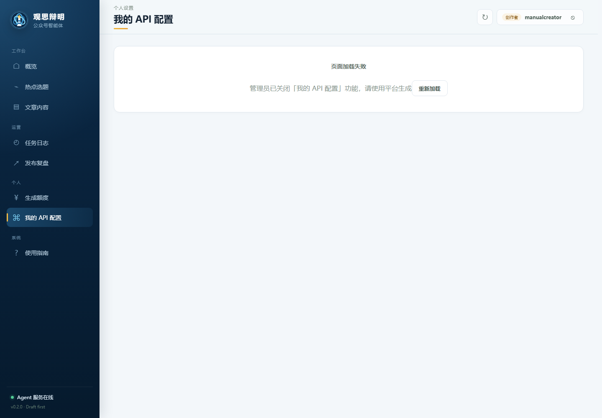
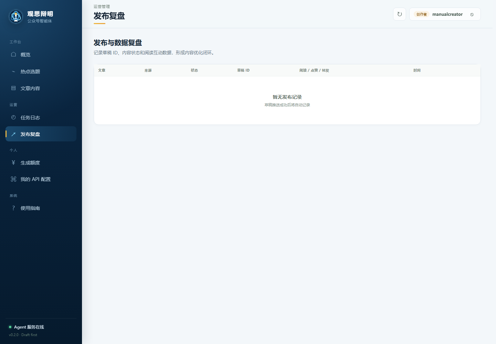

# 观思辩明智能体用户使用手册


## 目录

1. [产品能做什么](#一产品能做什么)
2. [注册、查询进度与登录](#二注册查询进度与登录)
3. [认识工作台](#三认识工作台)
4. [寻找和确定选题](#四寻找和确定选题)
5. [生成文章](#五生成文章)
6. [查看和控制生成任务](#六查看和控制生成任务)
7. [编辑和使用文章](#七编辑和使用文章)
8. [查看与购买生成额度](#八查看与购买生成额度)
9. [配置自己的 API](#九配置自己的-api)
10. [查看发布复盘](#十查看发布复盘)
11. [常见问题](#十一常见问题)
12. [发布前检查清单](#十二发布前检查清单)

## 一、产品能做什么

“观思辩明”是一套面向微信公众号创作者的内容工作流：

**热点发现 → 榜单外搜索 → 多源资料研究 → 文章生成 → 语义配图 → 人工编辑 → 公众号草稿。**

它不会替代最终判断。热点标题只是选题线索，生成文章仍需要你核对事实、来源、图片和表达。

### 用户账号可能看到的功能

| 功能 | 说明 |
|---|---|
| 概览 | 查看自己的内容和任务概况 |
| 热点选题 | 查看平台榜单、搜索全网内容并发起生成 |
| 文章内容 | 查看和编辑自己有权限访问的文章 |
| 生成额度 | 查看试用、付费次数以及使用记录 |
| 我的 API 配置 | 使用自己的模型、搜索和图片 API，是否显示由平台决定 |
| 任务日志 | 查看文章生成进度，暂停、继续或取消任务 |
| 发布复盘 | 查看自己有权访问的发布记录和互动数据 |
| 使用指南 | 在网站内查看本手册 |

创作者可以生成、编辑和删除自己的文章，但通常不能直接推送公众号；拥有推送权限的编辑账号会显示“推送公众号草稿”按钮。

## 二、注册、查询进度与登录

### 2.1 登录

打开网站，输入用户名和密码，点击“登录”。



登录失败时请检查：

- 用户名是否输入正确；
- 密码是否达到 8 位并与注册密码一致；
- 注册申请是否已经通过；
- 账号是否被暂停使用。

### 2.2 申请账号

在登录页点击“没有账号？申请注册”。



操作步骤：

1. 扫描页面中的公众号二维码并关注；
2. 填写用户名、密码、确认密码和手机号；
3. 确认已经扫码关注；
4. 提交注册申请；
5. 按页面提示，在公众号私信中发送注册手机号；
6. 返回登录页，通过“查询注册进度”了解审批状态；
7. 审批通过后使用用户名和密码登录。

注意：

- 用户名为 3–32 位字母或数字；
- 密码至少 8 位；
- 手机号用于注册核对，请填写本人可以接收和确认的号码；
- 不要把密码、API Key 或支付密码发送到公众号私信。

## 三、认识工作台

登录后默认进入“概览”。截图使用创作者账号，因此左侧只显示用户可操作的导航项。



页面主要区域：

- **左侧导航**：切换热点、文章、额度、API、任务和复盘页面；
- **顶部标题**：显示当前页面名称；
- **账号区域**：显示用户名和当前账号角色；
- **刷新按钮**：重新加载当前页面数据；
- **退出按钮**：清除登录状态并返回登录页。

不同账号的功能入口可能不同。如果某个菜单不存在，通常表示当前账号没有相应权限，或平台暂未开放该功能。

## 四、寻找和确定选题

### 4.1 查看榜单热点

进入“热点选题”，默认显示榜单内查询。


使用步骤：

1. 选择微博、知乎、头条、百度、哔哩哔哩或财联社等来源；
2. 输入关键词缩小范围，也可以直接浏览完整榜单；
3. 点击“关键词查询”或“刷新榜单”；
4. 查看标题、来源、排名、热度和选题分；
5. 找到合适内容后点击“选择”；
6. 在右侧“生成设置”中继续配置文章。

建议不要只看热度。优先选择与你的账号定位、目标读者和长期内容方向相关的话题。

### 4.2 榜单外全网搜索

如果榜单里没有合适话题，切换到“榜单外全网搜索”。



可以设置：

- 搜索关键词；
- 中文新闻或全网页；
- 24 小时、7 天、30 天、一年或不限时间；
- 中文结果优先。

搜索后可以直接选择结果，也可以把关键词作为自定义选题。搜索内容仍然只是研究入口，系统会在生成阶段继续收集多条信源。

## 五、生成文章

选择热点或自定义选题后，在右侧“生成设置”完成配置。

### 5.1 选择生成方式

#### 平台生成

使用平台提供的大模型、搜索和文生图服务：

- 优先扣除免费试用次数；
- 试用用完后扣除付费次数；
- 任务失败或取消时会释放预留额度；
- 只有文章成功保存后才结算次数。

#### 使用我的 API

使用你在“我的 API 配置”中保存的密钥：

- 不扣平台生成次数；
- 模型、搜索和文生图费用由对应服务商账户承担；
- 此选项可能由平台关闭。

### 5.2 设置文章要求

可以配置：

- **文章风格**：深度分析、资讯解读、故事化叙事、清单方法论等；
- **目标字数**：留空时使用平台默认值；
- **权威参考资料**：粘贴官方公告、报道链接、原文、数据或事实说明；
- **生成配图**：生成文章封面和正文语义插图。

建议提供至少两条可靠资料。资料越明确，文章中的事实、时间、数据和引用越容易核验。

### 5.3 当前原创写作框架

系统不会模仿具体账号或作者的措辞，而是根据题材选择通用新闻解释框架：

- 开头前 120 字给出最具体、反常或有现实后果的已核实事实，并提出核心问题；
- 正文让人物/机构与时间转折的叙事线，和利益/制度/技术约束的解释线交替推进；
- 重要判断采用“事实或数据—来源归因—机制解释—影响与边界”；
- 财经、国际历史、科技产业和社会议题分别使用不同的分析骨架；
- 结尾回到开头问题，说明有证据的结论、未知变量和后续观察指标；
- 标题强调数字、反差、时间跨度或机制问题，不使用无证据的绝对化结论。

完整研究样本、方法和风险边界见 `docs/EDITORIAL_STYLE_RESEARCH.md`。

### 5.4 低创作度内容自查与自动修复

事实核验阶段会做一次信息量与原创性体检，评分维度包括：段落信息量、含来源事实的段落比例、机制解释占比、独立数字数量、AIGC 套话和口号式表达。

如果体检发现问题，系统会：

1. **自动定点修复**：把信息量不足的段落和无法溯源的断言交给修复编辑，用信源中的具体事实、数字或机制解释改写；证据不足时删除该段落或断言，其余内容保持不变；
2. **修复后复检**：只有“包含失败占位文本”或“模型编辑思路”才会阻止保存；
3. **残留问题标记为高风险**：修复后仍有低创作度风险或无法溯源断言时，文章仍会保存，但会标记为高风险，推送公众号草稿会被服务端阻止，并在文章页列出需要人工修改的具体条目。

因此任务失败不再由质量问题触发，而是由真正的生成故障（模型报错、无法解析、内容为空）触发。

### 5.5 当前配图方式

配图不是文字卡片，而是根据文章内容生成的无文字场景插画：

- 封面根据最终标题和文章主题生成；
- 正文图根据章节标题及章节首段生成；
- 默认最多生成 2 张正文图；
- 图片提示词明确禁止文字、数字、Logo、水印和界面截图；
- OpenAI Image 若因版权/IP提示词限制返回 400，会自动改用不含具体实体名称的原创编辑插画提示词重试一次；
- 某张正文图最终失败时会跳过，不会自动降级为文字卡片。

图片仍可能出现模型理解偏差，发布前请检查人物、设备、场景和版权风险。

### 5.6 开始生成

点击“生成文章预览”后，系统会创建后台任务。生成过程包括：

1. 搜索并整理多源资料；
2. 生成文章大纲；
3. 分章节撰写正文；
4. 全文润色；
5. 两阶段事实核验；
6. 质量问题定点修复（仅在体检发现问题时触发一次）；
7. 生成候选标题；
8. 生成封面和正文配图；
9. 保存文章。

不要连续重复点击生成按钮。任务已经创建后，可以离开当前页面并前往“任务日志”。

## 六、查看和控制生成任务

进入“任务日志”。



你可以查看：

- 任务类型和任务编号；
- 当前状态和完成进度；
- 最近一条运行日志；
- 完整生成日志；
- 失败原因；
- 生成成功后的文章入口。

支持的操作：

- **暂停**：在当前外部 API 调用结束后的安全检查点暂停；
- **继续**：恢复已暂停任务；
- **取消**：在安全检查点停止任务；
- **删除日志**：只删除任务记录，不删除已经生成的文章。

“正在取消”或“等待暂停”不表示页面卡住，而是系统正在等待当前模型或图片请求完成。

## 七、编辑和使用文章

进入“文章内容”查看自己创建或有权访问的文章。



如果页面为空，请先到“热点选题”生成第一篇文章。

点击文章卡片后可以：

- 查看文章标题、摘要、字数和版本；
- 修改标题、摘要和 Markdown 正文；
- 从候选标题中切换标题；
- 查看证据充分度和事实核验结果；
- 查看公众号排版预览；
- 保存为新版本；
- 复制标题、封面或富文本正文；
- 删除自己拥有的文章。

### 推送权限

- 创作者账号通常不显示推送按钮；
- 有推送权限的编辑账号可以把文章推送到公众号草稿箱；
- 正式发布仍需进入公众号后台完成最终检查。

### 关于图片地址

站内预览图片可能显示为：

```text
/api/articles/{文章ID}/assets/cover.png?user_id=...&expires=...&sig=...
```

这是限时签名的站内预览地址，不是模型原始地址。推送公众号时，图片会上传至微信服务器并替换为微信素材地址。

## 八、查看与购买生成额度

进入“生成额度”。



页面包含：

- 总可用次数；
- 免费试用剩余次数；
- 付费生成次数；
- 个人 API 配置状态；
- 生成使用记录；
- 支付订单；
- 可购买的生成次数档位。

### 微信扫码购买

如果页面提供购买入口：

1. 选择购买档位；
2. 创建订单；
3. 使用微信扫描二维码；
4. 在订单有效期内完成支付；
5. 保持页面打开，等待系统查询到账结果；
6. 到账后重新查看总可用次数。

支付后长时间未到账时，请保留订单号并联系平台人员，不要重复支付同一个订单。

## 九、配置自己的 API

如果左侧显示“我的 API 配置”，可以保存自己的服务密钥。



支持三类服务：

- **LLM 写作服务**：用于大纲、正文、润色和事实核验；
- **搜索服务**：用于榜单外搜索和文章资料研究；
- **文生图服务**：用于封面和正文插图。

使用方法：

1. 填写 API Base URL；
2. 填写服务支持的模型名称；
3. 粘贴 API Key；
4. 保存配置；
5. 点击“测试连接”；
6. 生成文章时选择“使用我的 API”。

安全说明：

- API Key 加密保存在服务器；
- 页面不会重新返回完整密钥，只显示已配置状态；
- Key 输入框留空表示保留原值；
- 不再使用时可以清除对应服务配置；
- 不要在聊天、公众号私信、文章正文或截图中暴露 Key。

### 图片服务源选择

图片配置只提供两个选项：

| 图片服务源 | 使用方式 |
|---|---|
| Pillow 本地图片服务 | 不需要 URL、模型和 Key，不调用外部文生图 |
| 自定义源 | 填写图片 API Base URL、图片模型和对应 API Key |

自定义源默认按照 OpenAI Images 的 `/images/generations` 协议调用。如果填写百炼按量付费或 Token Plan 的原生图片地址，系统会自动识别对应协议、Key 类型和任务轮询主机。

注意：

- Token Plan 图片地址应配合 `sk-sp-...` 专属 Key；
- `compatible-mode/v1` 如果实现了 OpenAI Images 协议可以使用，系统会自动追加 `/images/generations`；
- Coding Plan 面向代码和文本模型，不提供文生图 API；
- `t2v` 或 `video` 模型是视频模型，不能用于文章静态配图；
- 第三方服务必须真正实现 `/images/generations`，只有 `/chat/completions` 不代表支持图片生成。

## 十、查看发布复盘

进入“发布复盘”。



页面用于查看有权访问的发布记录，包括：

- 文章名称；
- 内容来源；
- 草稿或发布状态；
- 草稿 ID；
- 阅读、点赞和转发数据；
- 创建时间。

如果当前账号没有推送权限或没有相关发布记录，页面可能为空。

## 十一、常见问题

### 1. 为什么无法登录？

确认申请已经通过、账号没有被停用，并检查用户名和密码。连续失败时不要反复尝试不同密码，应联系平台人员核对账号状态。

### 2. 为什么找不到“我的 API 配置”？

该功能可能暂未对用户开放，或者当前账号没有文章生成权限。此时可以使用平台生成。

### 3. 为什么平台生成按钮不可用？

常见原因包括：

- 免费和付费次数均为 0；
- 平台生成暂时关闭；
- 文章字数超过平台上限；
- 当前任务仍在运行。

### 4. 为什么文章生成失败？

在“任务日志”查看最后一条错误。常见原因包括：

- 搜索资料不足；
- 模型 API Key 无效或额度耗尽；
- 模型名称不在套餐范围内；
- 请求超时；
- 事实核验没有完成；
- 封面图片生成失败。

任务失败不会输出半成品文章，平台预留次数会释放。

### 5. 为什么正文配图数量少于设置数量？

正文图生成失败时会跳过，不再使用文字卡片代替。可以检查个人文生图配置，或者重新生成文章。

### 6. 为什么图片地址是本地地址？

这是站内限时预览地址。线上部署后会使用网站正式域名；推送公众号时会转换为微信图片地址。

### 7. 为什么不能推送公众号草稿？

创作者账号默认没有推送权限。请先使用复制标题、复制封面和复制富文本正文等功能，或者联系拥有推送权限的编辑协助。

### 8. 支付后次数没有到账怎么办？

先查看订单状态并等待页面自动查询。如果仍未到账，保存订单号并联系平台人员处理，不要提供支付密码。

### 9. 文章是否可以直接发布？

不建议。生成内容必须经过人工终审，特别检查人物、日期、数字、机构结论、引用、图片和外部链接。

## 十二、发布前检查清单

### 事实与来源

- [ ] 关键事实能够对应到可靠来源；
- [ ] 人物、机构、日期和数字准确；
- [ ] 没有把传闻写成确定事实；
- [ ] 外部链接可以正常访问；
- [ ] 文章结论没有超出证据范围。

### 标题与正文

- [ ] 标题与正文内容一致；
- [ ] 开头快速说明核心信息；
- [ ] 删除重复、空泛和机械表达；
- [ ] 保留自己的观点和账号语言风格；
- [ ] Markdown 层级和段落排版正常。

### 图片与发布

- [ ] 封面与文章主题一致；
- [ ] 图片没有乱码、伪文字、异常人物或错误设备；
- [ ] 正文图片插入位置合理；
- [ ] 已确认图片使用风险和平台规则；
- [ ] 已在公众号后台完成最终预览。

