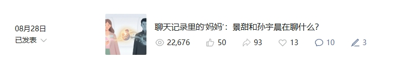
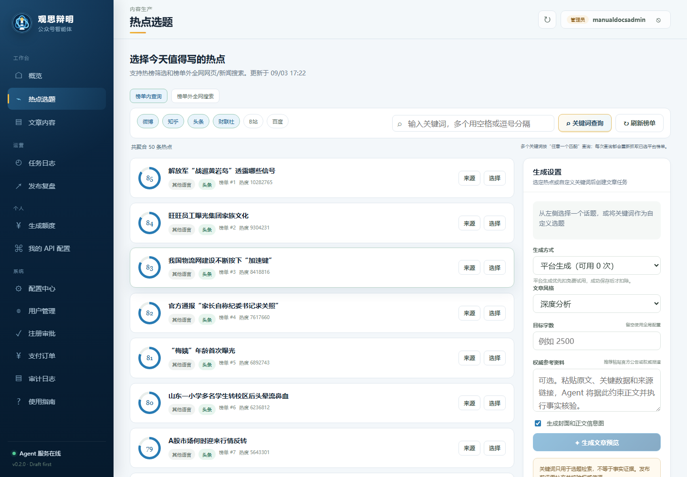
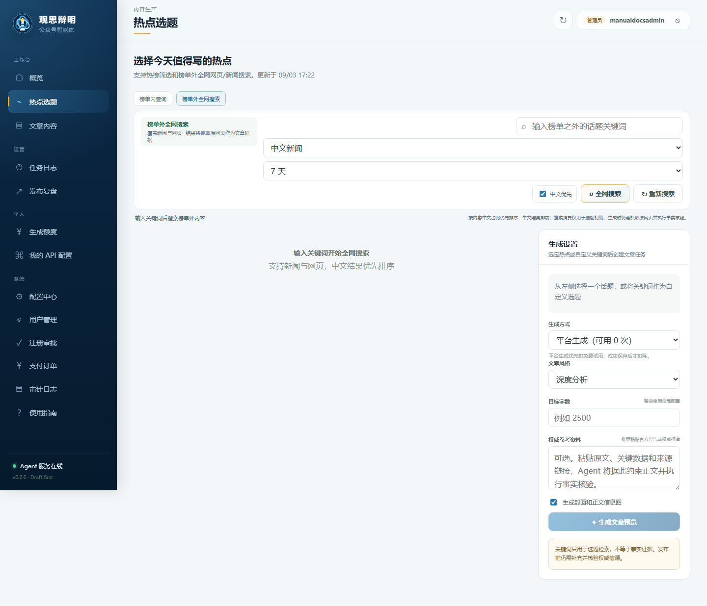
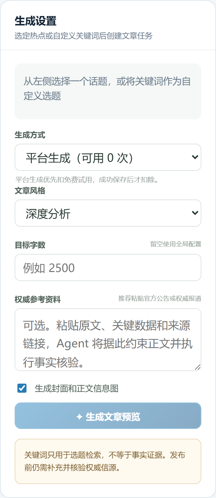
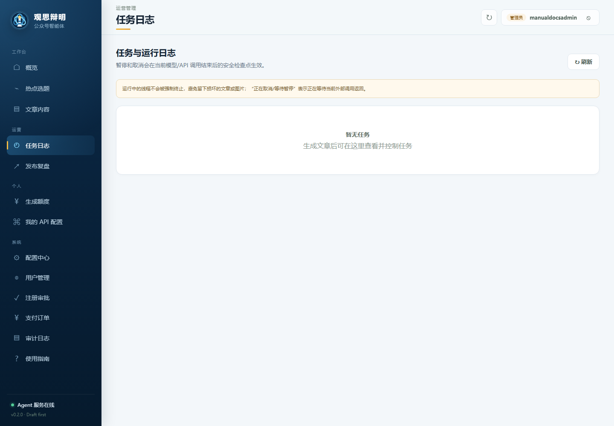
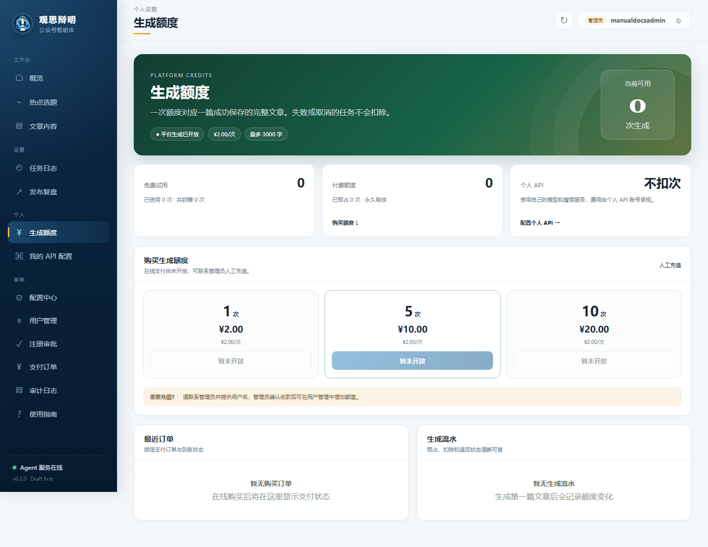

# 小红书推广文章（含 2w+ 阅读量真实案例）

> 全文从普通创作者视角撰写，不涉及管理员功能。
> 案例数据仅代表单篇作品表现，实际效果因账号定位、选题和运营策略而异。

## 推荐标题

**公众号运营人终于不用在多个工具之间来回切了！**

备选标题：

1. 已有创作者跑出 2w+ 阅读！这套公众号 AI 工作流分享给你
2. 从一个热点到公众号草稿，这套流程太省时间了
3. 公众号选题荒？试试这套 AI 内容工作流
4. 实测：输入关键词，生成一篇可继续编辑的公众号文章
5. 做公众号最耗时间的，原来不只是写作

---

## 封面文案

**公众号内容智能体**

从热点到草稿
一站式完成

角标：选题｜搜索｜写作｜配图｜草稿

---

## 正文

做公众号之后才发现，真正耗时间的往往不只是写作。

每次准备一篇文章，都需要：

🔍 查看不同平台的热点
📚 搜索新闻和参考资料
📝 整理文章结构
✍️ 撰写并修改初稿
🖼️ 制作封面和正文配图
📋 最后再整理进公众号草稿箱

整个过程经常需要在多个工具之间来回切换。

最近我在体验一个专门面向公众号创作者的内容智能体——**观思辩明**。

它不是一个简单的 AI 聊天框，而是把公众号内容生产串成了一套完整流程。

### 0️⃣ 先说结果：已经有创作者跑出 2w+ 阅读



已经有一位创作者，用这套流程完成的文章达到了 **2w+ 阅读量**（上图为其数据截图）。

当然，阅读量从来不是工具单方面决定的——选题方向、账号定位、标题和人工修改都很关键。

但至少说明一件事：**AI 初稿 + 人工判断**这条路线，是可以跑出真实数据的。

### 1️⃣ 不知道写什么？先从热点榜单开始

进入“热点选题”，可以查看多个平台的热门内容。

每条热点会展示：

- 热点来源
- 榜单排名
- 内容热度
- 选题评分
- 相关关键词

如果已经有大致方向，也可以直接输入关键词筛选。

看到合适的内容，点击“选择”，就能进入文章生成设置。



### 2️⃣ 榜单里没有？继续搜索全网内容

有时想写的是行业新闻、企业动态或垂直领域话题，不一定出现在热门榜单上。

这时可以切换到“榜单外全网搜索”。

输入关键词后，可以设置：

- 中文新闻或全网页
- 24 小时、7 天、30 天等时间范围
- 中文结果优先
- 自定义选题

既能追热点，也能找榜单之外更垂直的内容。



### 3️⃣ 按自己的需求设置文章

选好话题后，可以继续设置文章要求：

- 深度分析 / 资讯解读 / 故事化叙事 / 清单方法论
- 自定义目标字数
- 生成封面和正文信息图

如果手里有官方公告、权威报道、数据或来源链接，可以直接粘贴到“参考资料”中。

相比只输入一句提示词，这种方式更容易让文章围绕真实材料展开。



### 4️⃣ 自动生成初稿和配图

提交任务后，智能体会在后台完成：

✅ 资料检索
✅ 文章结构整理
✅ 正文初稿
✅ 候选标题
✅ 公众号封面
✅ 正文信息图

任务运行时，可以在“任务日志”查看进度，不用一直停在当前页面。



### 5️⃣ 生成后还能继续修改

文章生成完成后，会进入文章内容页面，可以继续：

- 修改文章标题
- 编辑正文内容
- 查看公众号排版效果
- 检查参考资料
- 调整文章结构和配图

它不会要求你直接采用 AI 生成的内容。

更合适的使用方式是：

> AI 完成资料整理和初稿，人负责观点、事实核验和最终表达。


### 6️⃣ 两种生成方式可选

**平台生成**：直接用平台提供的模型和搜索服务，按可用次数生成，适合不想单独准备 API 的用户。

**使用我的 API**：在“我的 API 配置”里填自己的模型、搜索和文生图服务，不扣平台生成次数。

暂时没有个人 API 也没关系，可以先使用平台体验额度完成第一篇文章。



---

## 案例 × 工作流：这篇 2w+ 是怎么来的

结合这位创作者的经验，一次高质量的产出大致是：

1. **选题不将就**：先看榜单，再用全网搜索确认话题热度与资料量；
2. **给足约束**：把目标字数、风格和权威参考资料提前设置好；
3. **初稿只是起点**：生成后逐段核对事实，替换更准确的表达；
4. **标题和开头亲自改**：候选标题只是参考，最终标题决定打开率；
5. **配图二次确认**：封面和信息图生成后，仍按账号风格做微调。

换句话说：**工具把 60% 的重复劳动做完，剩下的 40% 恰恰是你和别人的差距。**

---

## 我的真实感受

这个工具最有价值的地方，不是“一键替我写完一篇文章”，而是把原本分散的步骤串成了一条线：

**发现热点 → 搜索资料 → 选择方向 → 生成初稿 → 制作配图 → 修改文章**

以前经常卡在“不知道今天写什么”，现在可以先从热点和搜索结果里找到方向，再快速形成一份值得继续修改的初稿。

如果你也经常遇到：

- 公众号选题荒
- 搜资料花费太多时间
- AI 初稿内容空泛
- 多个工具反复切换
- 更新频率不稳定

可以体验一下这套工作流。

评论或私信我：**工作流**

我把完整的使用教程和体验方式发给你。

---

## 配图清单（10 张）

| 序号 | 图片文件 | 内容 | 建议文案 |
|---|---|---|---|
| 1 | `assets/xiaohongshu/01-cover.png` | 封面卡片 | 公众号内容智能体，从热点到草稿一站式完成 |
| 2 | `assets/xiaohongshu/02-dashboard.png` | 工作台 | 文章、热点和任务集中管理 |
| 3 | `assets/xiaohongshu/03-hotspots.png` | 榜单热点 | 不知道写什么？先看今天的热点 |
| 4 | `assets/xiaohongshu/04-web-search.png` | 榜单外搜索 | 榜单里没有？继续搜索全网内容 |
| 5 | `assets/xiaohongshu/05-settings.png` | 生成设置 | 风格、字数、参考资料都能控制 |
| 6 | `assets/xiaohongshu/06-tasks.png` | 任务进度 | 任务后台运行，不用一直等待 |
| 7 | `assets/xiaohongshu/07-articles.png` | 文章管理 | 生成后继续修改，不是直接发布 |
| 8 | `assets/xiaohongshu/08-billing.png` | 额度与个人 API | 平台额度与个人 API 两种方式 |
| 9 | `assets/xiaohongshu/09-case-2w.jpeg` | 真实案例截图 | 已有创作者跑出 2w+ 阅读 |
| 10 | `assets/xiaohongshu/10-action.png` | 行动页 | 评论/私信“工作流”获取教程 |

图片顺序建议与正文小节对应，第 9 张案例图尽量放在第 8 张之后、行动页之前，形成“方法 → 证据 → 行动”的收尾节奏。

---

## 推荐标签

```text
#公众号运营
#公众号写作
#新媒体运营
#AI写作
#内容创作
#自媒体工具
#内容运营
#效率工具
#运营人的一天
#人工智能
```

---

## 发布建议

1. 正文不要承诺“自动爆文”“保证 10 万+”；案例图旁保留“单篇表现，因账号而异”说明，更可信也更安全。
2. 封面突出“2w+ 阅读量”或“一站式完成”其中一个卖点即可，不要堆砌。
3. 案例截图是核心信任素材，若能补充该文章的标题、发布时间和账号领域，转化率会更高。
4. 评论区置顶：“回复‘工作流’，获取完整图文教程和体验方式。”
5. 发布后 1 小时内积极回复评论，有利于进入更多推荐流量池。
